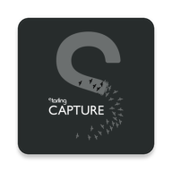

# Starling Capture

Starling Capture is a photo-sharing App with only verifiable photos and videos. Photos and videos are signed and uploaded to the decentralized storage with their fingerprint. Users can create groups and share the content with friends.

|   |   |   |
|---|---|---|
|   |   |   |

## Features

* Decentralized Storage with Textile
* Proof Generation with ProofMode
* Hardware Signature with Zion (Support HTC Exodus 1 and 1s currently)
